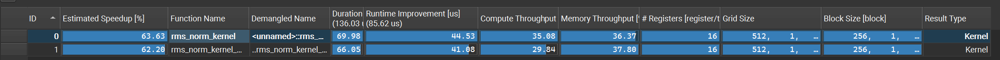
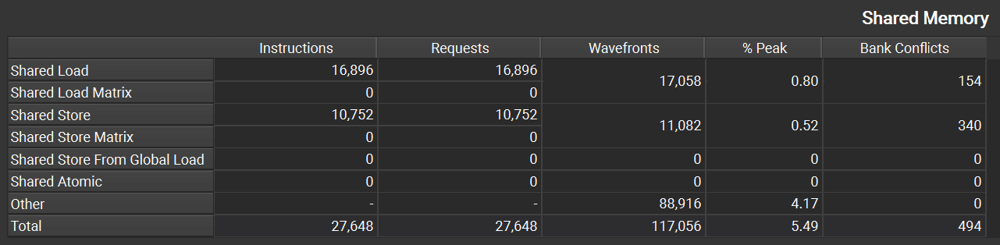
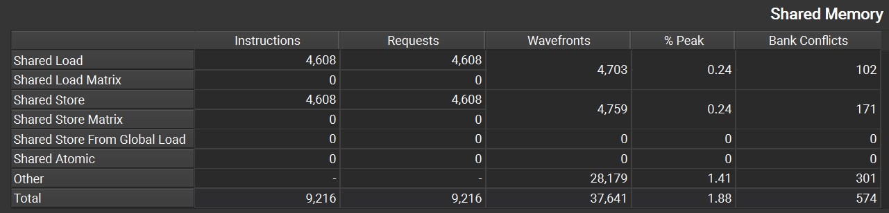
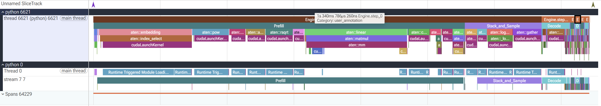
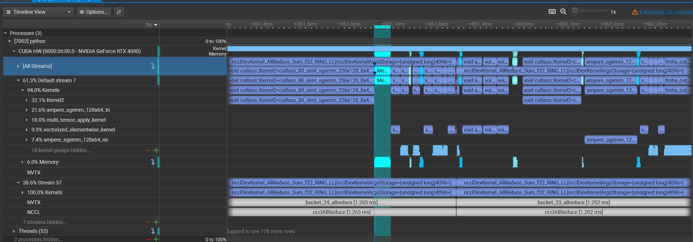

# Profiling 工具使用总览

让三种工具各回答一个最适合的问题。

## 1. Nsight Compute：RMSNorm Kernel 微观分析

**回答的问题：** Warp-shuffle 为什么比 Shared Memory 归约更高效？

采集对象：

```text
rmsnorm_shared
rmsnorm_warp_shuffle
```

关键结果：

- Shared Memory 指令总量从 `27,648` 降至 `9,216`，降低 `66.7%`。
- Shared Wavefront 从 `117,056` 降至 `37,641`，降低 `67.8%`。
- Bank Conflict 从 `494` 降至 `273`，降低 `44.7%`。
- NCU Kernel Duration 从 `69.98 us` 降至 `66.05 us`。

采集命令：

```bash
CUDA_VISIBLE_DEVICES=0 PYTHONPATH=src /usr/local/cuda/bin/ncu --set full --nvtx \
  --nvtx-include "rmsnorm_shared/" \
  --nvtx-include "rmsnorm_warp_shuffle/" \
  -o reports/ncu_rmsnorm -f \
  python evals/bench_rmsnorm.py --ncu-profile
```

### Duration

| 实现 | Kernel Duration |
| --- | ---: |
| Shared Memory | `69.98 us` |
| Warp-shuffle | `66.05 us` |

Warp-shuffle 比 Shared Memory 版本快约 `1.06x`。NCU 会重放 Kernel 采集硬件计数器，因此这里的绝对耗时高于普通 Benchmark，应主要关注两个 Kernel 之间的相对差异。

### Shared Memory 指标

| 指标 | Warp-shuffle | Shared Memory | 对比 |
| --- | ---: | ---: | ---: |
| Shared Load Instructions | `4,608` | `16,896` | 降低 `72.7%` |
| Shared Store Instructions | `4,608` | `10,752` | 降低 `57.1%` |
| Shared Instructions Total | `9,216` | `27,648` | 降低 `66.7%` |
| Shared Wavefronts Total | `37,641` | `117,056` | 降低 `67.8%` |
| Shared Memory % Peak | `1.88%` | `5.49%` | 降低 `65.8%` |
| Load/Store Bank Conflicts | `273` | `494` | 降低 `44.7%` |





## 2. torch.profiler：Inference Engine 宏观 Timeline

**回答的问题：** 一次 Engine Step 的 CPU 调度、Prefill、Decode 和 GPU Kernel 是如何排列的？

埋点范围：

```text
Engine.step_N
Scheduler
Prefill
Decode
Stack_and_Sample
Update_Request_State
```

运行命令：

```bash
CUDA_VISIBLE_DEVICES=0 PYTHONPATH=src \
  python evals/demo_inference_streaming.py --profile
```

脚本会打印 CUDA 算子摘要，并输出：

```text
reports/traces/inference_engine.json
```

采集结果：

- `Engine.step_0`：1340.8 ms，其中首个 Prefill 为 1107.6 ms。
- `Runtime Triggered Module Loading`：987.9 ms，首步主要是冷启动。
- `Engine.step_2~5`：13.3～15.7 ms。
- Scheduler：12～298 us，不是主要瓶颈。
- CUDA Self Time 合计约 0.42 ms，CPU Self Time 为 1483 ms。当前模型很小，端到端耗时主要来自模块加载、Python 循环和 Kernel Launch，GPU闲置严重。



## 3. Nsight Systems：DP 通信计算重叠

**回答的问题：** Gradient Bucket 的 NCCL AllReduce 是否与后续 Backward Compute 重叠？

NVTX 范围：

```text
dp_forward
dp_backward
bucket_N_allreduce
grad_sync_wait
optimizer_step
```

采集命令：

```bash
OMP_NUM_THREADS=1 CUDA_VISIBLE_DEVICES=0,1 PYTHONPATH=src \
nsys profile --trace=cuda,nvtx,osrt \
  --trace-fork-before-exec=true \
  --sample=none --cpuctxsw=none \
  --force-overwrite=true \
  -o reports/traces/nsys_dp_overlap \
  torchrun --standalone --nproc_per_node=2 evals/train.py \
  --mode dp --precision fp32 \
  --bucket-size-mb 0.05 --warmup 5 --steps 20 \
  --hidden-size 1024 --num-layers 4 --batch-size 8 --seq-len 256
```



每步产生 27 个 Gradient Bucket。Nsight Systems Timeline 显示 NCCL AllReduce 位于独立通信 Stream，并与默认 Stream 上的 Backward Kernel 存在明显重叠，说明 Bucket Hook 确实实现了通信计算重叠。grad_sync_wait 仍存在尾部等待，说明最后几个 Bucket 的通信尚未完全隐藏。当前 Bucket 较小，后续可以适当增大 Bucket，权衡通信启动开销和重叠机会。

