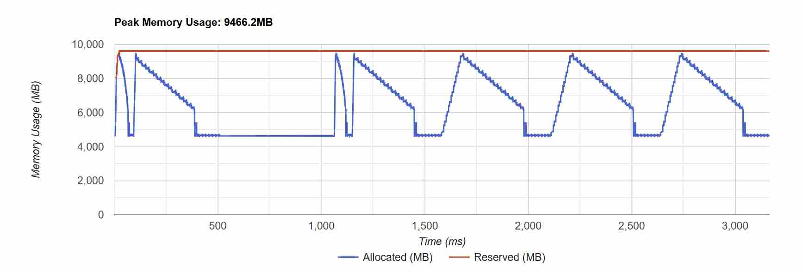
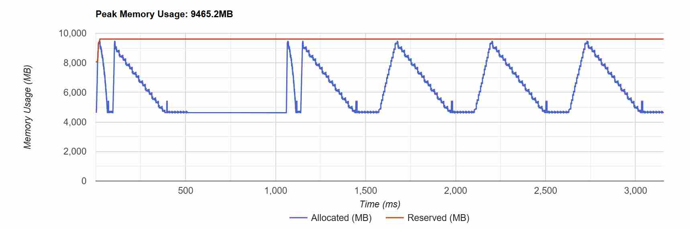
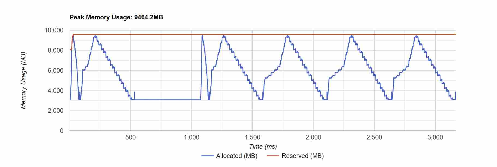

# Nano LLM Infra 训练框架测试报告

## 1. 测试目标

在双 GPU 环境下，验证训练框架中数据并行（DP）、张量并行（TP）、流水线并行（PP）和 ZeRO 各阶段的正确性、训练性能与显存优化效果。

> 不同模块使用的模型规模并不相同，因此只在各模块内部做对比，不横向比较 DP、TP、PP 和 ZeRO 的绝对耗时。

## 2. 数据并行与单卡优化

FP32 数据并行基线的单步耗时为 29.113 ms，吞吐量为 140691.7 tok/s，峰值显存为 1422.1 MB。

- AMP 将单步耗时降低到 23.901 ms，减少约 17.9%；吞吐量提高约 21.8%；峰值显存降低约 9.0%。说明混合精度能够同时改善计算速度和显存占用。
- 激活检查点将峰值显存降低到 1175.5 MB，减少约 17.3%；但单步耗时增加约 12.9%。结果符合“用额外重计算换取显存”的设计目标。
- 将通信 bucket 设置为 0.01 MB 后，单步耗时为 29.468 ms，与基线基本一致。小 bucket 没有带来收益，说明过细的通信粒度会增加调度开销，bucket 大小需要结合模型和硬件调节。

### Nsight Systems：DP 通信计算重叠

DP Runtime 在 `dp_forward`、`dp_backward`、`bucket_N_allreduce`、`grad_sync_wait` 和 `optimizer_step` 上添加了 NVTX Range。Nsight Systems 只用于这一处宏观分布式 Timeline 分析：

```bash
OMP_NUM_THREADS=1 CUDA_VISIBLE_DEVICES=0,1 PYTHONPATH=src \
nsys profile --trace=cuda,nvtx,osrt \
  --trace-fork-before-exec=true \
  --sample=none --cpuctxsw=none \
  --force-overwrite=true \
  -o reports/nsys_dp_overlap \
  torchrun --standalone --nproc_per_node=2 evals/train.py \
  --mode dp --precision fp32 \
  --bucket-size-mb 0.05 --warmup 5 --steps 20 \
  --hidden-size 1024 --num-layers 4 --batch-size 8 --seq-len 256
```

导出摘要：

```bash
nsys stats --report cuda_gpu_kern_sum,nvtx_sum \
  reports/nsys_dp_overlap.nsys-rep
```

本次采集得到：

- 每卡每步形成 27 个 Gradient Bucket；两个 Rank、25 次迭代（含 5 次 warmup）共采集 1350 个 NCCL AllReduce Kernel。
- 其中 862 个 NCCL Kernel 与同卡计算 Kernel 存在时间交集，占 `63.9%`。
- NCCL Kernel 总时长为 `1102.397 ms`，与计算重叠的区间为 `541.007 ms`，按通信时长计算重叠率为 `49.1%`。
- `dp_backward` CPU Range 平均为 `28.458 ms`，`grad_sync_wait` 平均为 `5.975 ms`。说明 Bucket Hook 已隐藏部分通信，但仍有明显尾部通信等待。
- NCCL AllReduce 占 GPU Kernel 总时长的 `46.8%`。当前 `0.05 MB` Bucket 产生 27 次 AllReduce，通信粒度偏细，后续可继续合并 Bucket，权衡重叠机会与启动开销。

Timeline 中可以看到 NCCL 位于独立通信 Stream，并与默认计算 Stream 上的 Backward Kernel 横向重叠，因此通信计算重叠已经真实发生，而不是只根据代码结构推断。

本次 nsys 下平均单步为 `43.490 ms`、吞吐为 `94181.5 tok/s`。该数据包含 profiler 采集开销，只用于 Timeline 分析，不与无 profiler 的 `29.113 ms` 基线直接比较。

## 3. 张量并行

在相同 MLP 计算任务下：

- Dense MLP：57.522 ms，峰值显存 2192.3 MB。
- TP MLP：32.088 ms，峰值显存 1936.3 MB。

双卡 TP 将前向与反向总耗时降低约 44.2%，峰值显存降低约 11.7%。前向最大误差为 `3.98e-6`，梯度最大误差为 0，说明并行实现与 Dense 参考结果基本一致。

## 4. 流水线并行

- Naive：14.952 ms，峰值显存 19.4 MB。
- GPipe：12.979 ms，峰值显存 26.2 MB。
- 1F1B：15.930 ms，峰值显存 21.7 MB。

GPipe 相比 Naive 将耗时降低约 13.2%，但峰值显存增加约 35.1%，原因是先执行全部前向会同时保存多个 microbatch 的激活。

1F1B 相比 GPipe 将峰值显存降低约 17.2%，但耗时增加约 22.7%。当前模型很小，前后向切换和点对点通信的固定开销占比较高，1F1B 的显存优势在当前小模型上伴随着额外调度开销。

## 5. ZeRO 显存演进

| 阶段 | 单步耗时 | 峰值显存 | 反向结束显存 |
| --- | ---: | ---: | ---: |
| ZeRO-0 | 517.347 ms | 12542.5 MB | 9247.1 MB |
| ZeRO-1 | 532.059 ms | 9466.2 MB | 6170.8 MB |
| ZeRO-2 | 531.973 ms | 9465.2 MB | 4632.7 MB |
| ZeRO-3 | 529.135 ms | 9464.2 MB | 3094.5 MB |

ZeRO-1 切分优化器状态后，相比 ZeRO-0：

- 峰值显存降低约 24.5%；
- 反向结束显存降低约 33.3%；
- 单步耗时增加约 2.8%。

ZeRO-2 进一步切分梯度。它与 ZeRO-1 的峰值显存几乎相同，因为峰值主要由前向激活决定；但反向结束显存降低约 24.9%，从 6170.8 MB 降到 4632.7 MB，清楚体现了梯度边计算、边通信、边释放的效果。

ZeRO-3 进一步切分参数，反向结束显存从 4632.7 MB 降到 3094.5 MB，相比 ZeRO-0 总体降低约 66.5%。由于当前 Demo 会在前向时一次性拉取全部参数，而非逐层拉取和释放，因此 ZeRO-3 的峰值显存仍与 ZeRO-2 接近。

在当前实现中，`bw_end_mem` 比 `peak_mem` 更适合观察 ZeRO-1、ZeRO-2 和 ZeRO-3 的递进关系：

- ZeRO-1 保留完整参数和完整梯度；
- ZeRO-2 保留完整参数，但提前释放完整梯度；
- ZeRO-3 进一步释放完整参数，只长期保存本卡负责的分片。

### 显存时间曲线

**ZeRO-1：反向传播结束前仍保留完整梯度**



**ZeRO-2：梯度在反向传播过程中逐步释放**



**ZeRO-3：进一步释放完整参数**



## 6. Expert Parallelism

双卡 EP 在 4 个 Expert、1024 个 Token 的配置下，两次测试的单步耗时分别为 11.172 ms 和 12.160 ms，平均约 11.666 ms，峰值显存均为 87.3 MB。

输出最大误差为 `8.94e-8`，输入梯度最大误差为 `2.24e-7`，Expert 梯度最大误差为 `3.81e-6`。Router 梯度最大误差为 `1.91e-5`，来自不同通信与累加顺序下的浮点误差。结果说明 Token Dispatch、Expert Compute、Combine 及其反向传播与 Dense MoE 参考实现基本一致。

Expert 负载为 `[280, 260, 219, 265]`，最大负载约为最小负载的 1.28 倍。在 `capacity_factor=1.0` 时，每个 Expert 容量为 256，因此共丢弃 37 个 Token，占总 Token 的约 3.6%。这个结果直接体现了 Router 负载不均和固定 Capacity 带来的 Token Drop，也说明负载最重的 Expert 会成为 EP 的潜在 Straggler。

## 7. Context Parallelism

双卡 CP 将长度为 1024 的完整序列切成每卡 512 Token，通过 Ring P2P 轮转 K/V，使每张卡保留本地 Query，同时完成对完整上下文的 Causal Attention。

前向输出最大误差为 `3.58e-7`，输入梯度最大误差为 `1.10e-5`，QKV 梯度最大误差为 `6.41e-4`，输出投影梯度最大误差为 `9.16e-5`。前向结果与 Dense Attention 高度一致；梯度误差稍大，主要来自长序列分块计算、Online Softmax 和跨 Rank 梯度累加顺序不同，当前数量级可以接受。

修复 P2P 收发 Tensor 的连续内存布局后，非连续 Tensor Warning 消失，QKV 梯度误差从 `6.25` 降至 `6.41e-4`，说明 Ring Exchange 的前向与反向通信路径已经正确工作。

20 次正式迭代的平均单步耗时为 `11.092 ms`，峰值显存为 `145.4 MB`。这组数据证明双卡 Ring Attention 能够正确切分序列并完成前向和反向，但当前只测试了长度 1024，尚不能证明已经突破单卡长序列 OOM 上限。

## 8. 总结

测试结果验证了各模块的核心设计：

1. AMP 提升吞吐并降低显存，激活检查点以重计算换取显存。
2. TP 在大矩阵计算中能够有效分摊计算和参数存储，同时保持数值正确性。
3. GPipe 更快但保存更多激活；1F1B 显存更低，但小模型下调度开销明显。
4. ZeRO 各阶段确实依次消除了优化器状态、梯度和参数冗余；当前 Demo 的主要限制是 ZeRO-3 尚未实现逐层参数拉取。
5. EP 的输出和梯度与 Dense MoE 基本对齐；实测负载分布和 Token Drop 验证了 Capacity 与 Router 不均衡机制。
6. CP 的前向和梯度与 Dense Attention 基本对齐，验证了序列切分、Ring P2P 和 Online Softmax 的正确性。

本次结果主要用于验证实现逻辑。若要做严格性能结论，还需要固定 GPU 型号与软件环境，进行更多重复测试并统计均值和波动范围。

## 9. 原始测试命令与输出

### 9.1 DP 基线（FP32）

```bash
torchrun --nproc_per_node=2 evals/train.py --mode dp \
  --precision fp32 --warmup 5 --steps 20 \
  --hidden-size 1024 --num-layers 4 --batch-size 8 --seq-len 256
```

```text
[dp] world=2 precision=fp32 ckpt=False hidden=1024 layers=4 batch=8 seq=256
[dp] loss=4.8780 avg_step=29.113 ms throughput=140691.7 tok/s peak_mem=1422.1 MB
```

### 9.2 DP + AMP

```bash
torchrun --nproc_per_node=2 evals/train.py --mode dp \
  --precision fp16 --warmup 5 --steps 20 \
  --hidden-size 1024 --num-layers 4 --batch-size 8 --seq-len 256
```

```text
[dp] world=2 precision=fp16 ckpt=False hidden=1024 layers=4 batch=8 seq=256
[dp] loss=4.8780 avg_step=23.901 ms throughput=171371.5 tok/s peak_mem=1293.6 MB
```

### 9.3 DP + 激活检查点

```bash
torchrun --nproc_per_node=2 evals/train.py --mode dp \
  --activation-checkpoint --warmup 5 --steps 20 \
  --hidden-size 1024 --num-layers 4 --batch-size 8 --seq-len 256
```

```text
[dp] world=2 precision=fp32 ckpt=True hidden=1024 layers=4 batch=8 seq=256
[dp] loss=4.8780 avg_step=32.867 ms throughput=124621.8 tok/s peak_mem=1175.5 MB
```

### 9.4 DP 通信与计算重叠

```bash
torchrun --nproc_per_node=2 evals/train.py --mode dp \
  --bucket-size-mb 0.01 --warmup 5 --steps 20 \
  --hidden-size 1024 --num-layers 4 --batch-size 8 --seq-len 256
```

```text
[dp] world=2 precision=fp32 ckpt=False hidden=1024 layers=4 batch=8 seq=256
[dp] loss=4.8780 avg_step=29.468 ms throughput=138999.4 tok/s peak_mem=1422.1 MB
```

### 9.5 张量并行

```bash
torchrun --nproc_per_node=2 evals/train.py --mode tp \
  --warmup 10 --steps 50 \
  --hidden-size 4096 --batch-size 8 --seq-len 512
```

```text
[tp] forward max diff=3.978610e-06
[tp] rowparallel grad max diff=0.000000e+00
[tp] world=2 hidden=4096 batch=8 seq=512
[tp] dense MLP fwd+bwd: 57.522 ms, peak_mem=2192.3 MB
[tp] TP MLP fwd+bwd:    32.088 ms, peak_mem=1936.3 MB
```

### 9.6 PP Naive

```bash
torchrun --nproc_per_node=2 evals/train.py --mode pp \
  --pp-schedule naive --num-layers 4 --num-microbatches 4 \
  --batch-size 16 --seq-len 128 --warmup 5 --steps 10
```

```text
[pp][rank 1] last microbatch loss=1.1750
[pp] world=2 schedule=naive hidden=32 layers=4 microbatches=4
[pp] avg_step=14.952 ms, peak_mem=19.4 MB
[pp] naive: F0 B0 F1 B1 F2 B2 F3 B3
```

### 9.7 PP GPipe

```bash
torchrun --nproc_per_node=2 evals/train.py --mode pp \
  --pp-schedule gpipe --num-layers 4 --num-microbatches 4 \
  --batch-size 16 --seq-len 128 --warmup 5 --steps 10
```

```text
[pp] world=2 schedule=gpipe hidden=32 layers=4 microbatches=4
[pp] avg_step=12.979 ms, peak_mem=26.2 MB
[pp] gpipe: F0 F1 F2 F3 B3 B2 B1 B0
[pp][rank 1] last microbatch loss=1.1789
```

### 9.8 PP 1F1B

```bash
torchrun --nproc_per_node=2 evals/train.py --mode pp \
  --pp-schedule 1f1b --num-layers 4 --num-microbatches 4 \
  --batch-size 16 --seq-len 128 --warmup 5 --steps 10
```

```text
[pp] world=2 schedule=1f1b hidden=32 layers=4 microbatches=4
[pp] avg_step=15.930 ms, peak_mem=21.7 MB
[pp] 1f1b: F0 F1 B0 F2 B1 F3 B2 B3
[pp][rank 1] last microbatch loss=1.1750
```

### 9.9 ZeRO-0

```bash
torchrun --nproc_per_node=2 evals/train.py --mode zero \
  --zero-stage 0 --bucket-size-mb 0.1 --warmup 2 --steps 5 \
  --hidden-size 2048 --num-layers 8 --batch-size 4 --seq-len 1024
```

```text
[zero0] before=[0.018332690000534058, -0.0016543138772249222, -0.013088597916066647, -0.0075582233257591724]
[zero0] after rank0=[0.01933269016444683, -0.0006543141207657754, -0.012088598683476448, -0.006558223161846399]
[zero0] after rank1=[0.01933269016444683, -0.0006543141207657754, -0.012088598683476448, -0.006558223161846399]
[zero0] world=2 hidden=2048 batch=4 seq=1024
[zero0] avg_step=517.347 ms, peak_mem=12542.5 MB, bw_end_mem=9247.1 MB
```

### 9.10 ZeRO-1

```bash
torchrun --nproc_per_node=2 evals/train.py --mode zero \
  --zero-stage 1 --bucket-size-mb 0.1 --warmup 2 --steps 5 \
  --hidden-size 2048 --num-layers 8 --batch-size 4 --seq-len 1024
```

```text
[zero1] before=[0.018332690000534058, -0.0016543138772249222, -0.013088597916066647, -0.0075582233257591724]
[zero1] after rank0=[0.01933269016444683, -0.0006543141207657754, -0.012088598683476448, -0.006558223161846399]
[zero1] after rank1=[0.01933269016444683, -0.0006543141207657754, -0.012088598683476448, -0.006558223161846399]
[zero1] world=2 hidden=2048 batch=4 seq=1024
[zero1] avg_step=532.059 ms, peak_mem=9466.2 MB, bw_end_mem=6170.8 MB
```

### 9.11 ZeRO-2

```bash
torchrun --nproc_per_node=2 evals/train.py --mode zero \
  --zero-stage 2 --bucket-size-mb 0.1 --warmup 2 --steps 5 \
  --hidden-size 2048 --num-layers 8 --batch-size 4 --seq-len 1024
```

```text
[zero2] before=[0.018332690000534058, -0.0016543138772249222, -0.013088597916066647, -0.0075582233257591724]
[zero2] after rank0=[0.01933269016444683, -0.0006543141207657754, -0.012088598683476448, -0.006558223161846399]
[zero2] after rank1=[0.01933269016444683, -0.0006543141207657754, -0.012088598683476448, -0.006558223161846399]
[zero2] world=2 hidden=2048 batch=4 seq=1024
[zero2] avg_step=531.973 ms, peak_mem=9465.2 MB, bw_end_mem=4632.7 MB
```

### 9.12 ZeRO-3

```bash
torchrun --nproc_per_node=2 evals/train.py --mode zero \
  --zero-stage 3 --bucket-size-mb 0.1 --warmup 2 --steps 5 \
  --hidden-size 2048 --num-layers 8 --batch-size 4 --seq-len 1024
```

```text
[zero3] after rank0=[]
[zero3] after rank1=[]
[zero3] world=2 hidden=2048 batch=4 seq=1024
[zero3] avg_step=529.135 ms, peak_mem=9464.2 MB, bw_end_mem=3094.5 MB
```

### 9.13 Expert Parallelism

```bash
CUDA_VISIBLE_DEVICES=0,1 PYTHONPATH=src torchrun --standalone \
  --nproc_per_node=2 evals/train.py \
  --mode ep \
  --hidden-size 512 \
  --batch-size 8 \
  --seq-len 128 \
  --num-experts 4 \
  --capacity-factor 1.0 \
  --warmup 5 \
  --steps 20
```

```text
[ep] world=2 experts=4 capacity_factor=1.0
[ep] output diff=8.940697e-08, input.grad diff=2.235174e-07, router grad diff=1.907349e-05, expert grad diff=3.814697e-06
[ep] expert_load=[280, 260, 219, 265] dropped_tokens=37
[ep] avg_step=11.172 ms, peak_mem=87.3 MB
```

重复测试：

```text
[ep] avg_step=12.160 ms, peak_mem=87.3 MB
```

### 9.14 Context Parallelism

```bash
CUDA_VISIBLE_DEVICES=0,1 PYTHONPATH=src torchrun --standalone \
  --nproc_per_node=2 evals/train.py \
  --mode cp \
  --hidden-size 512 \
  --batch-size 4 \
  --seq-len 1024 \
  --warmup 5 \
  --steps 20
```

```text
[cp] world=2 global_seq=1024 local_seq=512
[cp] output diff=3.576279e-07, input.grad diff=1.096725e-05, qkv grad diff=6.408691e-04, out_proj grad diff=9.155273e-05
[cp] avg_step=11.092 ms, peak_mem=145.4 MB
```
